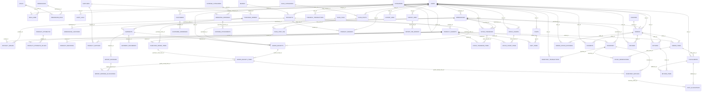

# ERD vật lý

```mermaid
erDiagram
    ROLES ||--o{ ROLE_USER : role_id
    USERS ||--o{ ROLE_USER : user_id
    PERMISSIONS ||--o{ PERMISSION_ROLE : permission_id
    ROLES ||--o{ PERMISSION_ROLE : role_id
    USERS ||--o{ AUDIT_LOGS : user_id
    CATEGORIES ||--o{ CATEGORIES : parent_id
    CATEGORIES ||--o{ PRODUCTS : category_id
    BRANDS ||--o{ PRODUCTS : brand_id
    PRODUCTS ||--o{ PRODUCT_VARIANTS : product_id
    PRODUCTS ||--o{ PRODUCT_IMAGES : product_id
    PRODUCT_VARIANTS ||--o{ PRODUCT_IMAGES : variant_id
    PRODUCT_ATTRIBUTES ||--o{ PRODUCT_ATTRIBUTE_VALUES : attribute_id
    PRODUCT_VARIANTS ||--o{ PRODUCT_ATTRIBUTE_VALUES : variant_id
    PRODUCT_VARIANTS ||--o{ PRODUCT_BARCODES : variant_id
    PRODUCT_VARIANTS ||--o{ PRODUCT_SUPPLIER : variant_id
    SUPPLIERS ||--o{ PRODUCT_SUPPLIER : supplier_id
    USERS ||--o{ WAREHOUSES : manager_id
    WAREHOUSES ||--o{ WAREHOUSE_LOCATIONS : warehouse_id
    SUPPLIERS ||--o{ PURCHASE_ORDERS : supplier_id
    PURCHASE_ORDERS ||--o{ PURCHASE_ORDER_ITEMS : purchase_order_id
    PRODUCT_VARIANTS ||--o{ PURCHASE_ORDER_ITEMS : variant_id
    PURCHASE_ORDERS ||--o{ SHIPMENTS : purchase_order_id
    WAREHOUSES ||--o{ SHIPMENTS : warehouse_id
    SHIPMENTS ||--o{ SHIPMENT_DOCUMENTS : shipment_id
    PURCHASE_ORDERS ||--o{ GOODS_RECEIPTS : purchase_order_id
    WAREHOUSES ||--o{ GOODS_RECEIPTS : warehouse_id
    SHIPMENTS ||--o{ GOODS_RECEIPTS : shipment_id
    USERS ||--o{ GOODS_RECEIPTS : user_id
    GOODS_RECEIPTS ||--o{ GOODS_RECEIPT_ITEMS : goods_receipt_id
    PURCHASE_ORDER_ITEMS ||--o{ GOODS_RECEIPT_ITEMS : purchase_order_item_id
    SHIPMENTS ||--o{ IMPORT_EXPENSES : shipment_id
    IMPORT_EXPENSES ||--o{ IMPORT_EXPENSE_ALLOCATIONS : import_expense_id
    GOODS_RECEIPT_ITEMS ||--o{ IMPORT_EXPENSE_ALLOCATIONS : goods_receipt_item_id
    WAREHOUSES ||--o{ INVENTORY : warehouse_id
    PRODUCT_VARIANTS ||--o{ INVENTORY : variant_id
    INVENTORY ||--o{ INVENTORY_BATCHES : inventory_id
    GOODS_RECEIPT_ITEMS ||--o{ INVENTORY_BATCHES : goods_receipt_item_id
    INVENTORY ||--o{ INVENTORY_TRANSACTIONS : inventory_id
    USERS ||--o{ INVENTORY_TRANSACTIONS : user_id
    WAREHOUSES ||--o{ STOCK_TRANSFERS : from_id
    WAREHOUSES ||--o{ STOCK_TRANSFERS : to_id
    USERS ||--o{ STOCK_TRANSFERS : user_id
    STOCK_TRANSFERS ||--o{ STOCK_TRANSFER_ITEMS : stock_transfer_id
    PRODUCT_VARIANTS ||--o{ STOCK_TRANSFER_ITEMS : variant_id
    WAREHOUSES ||--o{ STOCK_COUNTS : warehouse_id
    USERS ||--o{ STOCK_COUNTS : user_id
    STOCK_COUNTS ||--o{ STOCK_COUNT_ITEMS : stock_count_id
    PRODUCT_VARIANTS ||--o{ STOCK_COUNT_ITEMS : variant_id
    USERS ||--o{ CUSTOMERS : user_id
    CUSTOMERS ||--o{ CUSTOMER_ADDRESSES : customer_id
    USERS ||--o{ CARTS : user_id
    CARTS ||--o{ CART_ITEMS : cart_id
    PRODUCT_VARIANTS ||--o{ CART_ITEMS : variant_id
    USERS ||--o{ ORDERS : user_id
    WAREHOUSES ||--o{ ORDERS : warehouse_id
    COUPONS ||--o{ ORDERS : coupon_id
    ORDERS ||--o{ ORDER_ITEMS : order_id
    PRODUCT_VARIANTS ||--o{ ORDER_ITEMS : variant_id
    ORDER_ITEMS ||--o{ STOCK_RESERVATIONS : order_item_id
    INVENTORY ||--o{ STOCK_RESERVATIONS : inventory_id
    ORDERS ||--o{ ORDER_STATUS_HISTORIES : order_id
    USERS ||--o{ ORDER_STATUS_HISTORIES : user_id
    ORDERS ||--o{ PAYMENTS : order_id
    USERS ||--o{ PAYMENTS : user_id
    ORDER_ITEMS ||--o{ FULFILLMENTS : order_item_id
    USERS ||--o{ FULFILLMENTS : user_id
    FULFILLMENTS ||--o{ COST_ALLOCATIONS : fulfillment_id
    INVENTORY_BATCHES ||--o{ COST_ALLOCATIONS : inventory_batch_id
    ORDERS ||--o{ RETURNS : order_id
    USERS ||--o{ RETURNS : user_id
    RETURNS ||--o{ RETURN_ITEMS : return_id
    FULFILLMENTS ||--o{ RETURN_ITEMS : fulfillment_id
    ORDERS ||--o{ REFUNDS : order_id
    USERS ||--o{ REFUNDS : user_id
    EXPENSE_CATEGORIES ||--o{ OPERATING_EXPENSES : expense_category_id
    USERS ||--o{ OPERATING_EXPENSES : user_id
    OPERATING_EXPENSES ||--o{ EXPENSE_ATTACHMENTS : operating_expense_id
    USERS ||--o{ FINANCIAL_TRANSACTIONS : user_id
    USERS ||--o{ BLOG_POSTS : user_id
    BLOG_CATEGORIES ||--o{ BLOG_POSTS : blog_category_id
    BLOG_POSTS ||--o{ BLOG_POST_TAG : blog_post_id
    BLOG_TAGS ||--o{ BLOG_POST_TAG : blog_tag_id
    USERS ||--o{ PRODUCT_REVIEWS : user_id
    PRODUCTS ||--o{ PRODUCT_REVIEWS : product_id
    USERS ||--o{ IMPORT_JOBS : user_id
    IMPORT_JOBS ||--o{ IMPORT_JOB_ERRORS : import_job_id
    USERS ||--o{ EXPORT_JOBS : user_id
```
